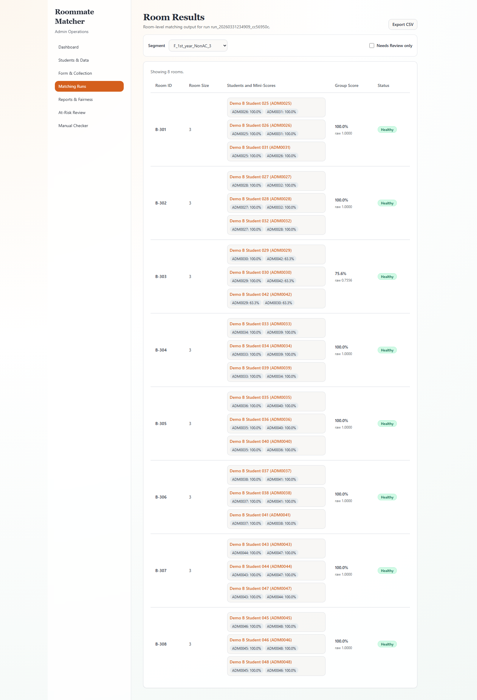
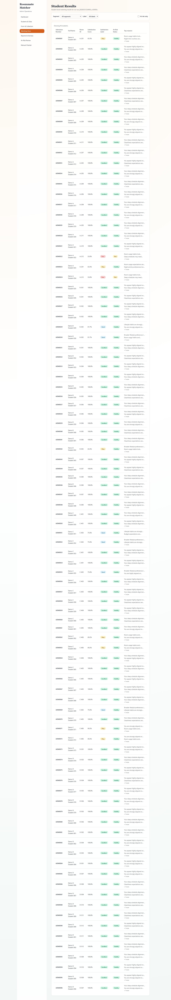
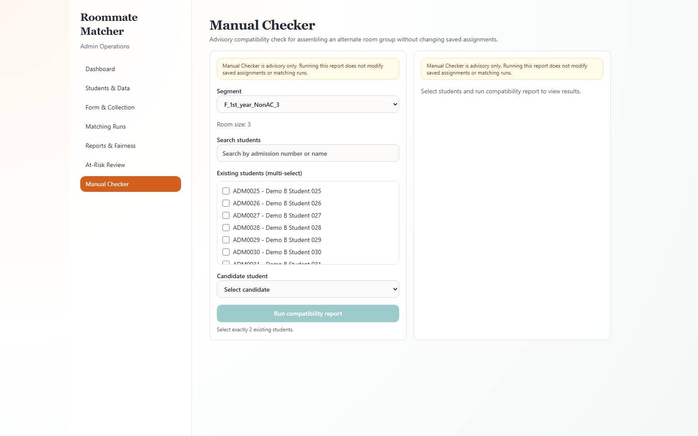

# Roommate Matcher

**Graph-based hostel roommate allocation with weighted compatibility scoring, blossom-algorithm matching, and per-run fairness reporting.**

Built as a fully local, production-structured full-stack system — FastAPI backend, React + TypeScript frontend, SQLite persistence, deterministic matching artifacts versioned by run ID.

---

## The problem

Traditional hostel allocation is purely logistical — it fills beds, not compatibility gaps. The result is avoidable roommate conflicts that escalate into welfare issues for administrators to manage.

Roommate Matcher keeps all physical and policy constraints intact (gender, year group, AC type, room size) but adds a compatibility layer on top: multi-factor lifestyle scoring, graph-theoretic assignment, and explainability output that tells admins *why* each pairing was made.

---

## What makes this interesting

- **Graph matching at the core.** 2-bed segments use maximum-weight bipartite matching. 3-bed segments use blossom-seeded pair growth with a "fewest good options first" scheduling heuristic — seed units with fewer compatible candidates are processed first so the hardest placements are resolved before the pool shrinks. 4-bed segments build high-quality pairs via max-weight matching, then merge pair+pair by maximising internal mean score across all six pairwise edges in the room.

- **Multi-criteria swap optimization.** After initial assignment, a bounded post-pass swap phase evaluates every cross-room student swap using a strict priority order: minimum satisfaction first, then poor-student count, then total satisfaction, then a deterministic tie-break by room and student ID. A swap is only accepted if it strictly improves minimum satisfaction without introducing any new Poor-label students. Up to three passes run; the phase short-circuits early if a pass produces no accepted swap or revisits a previously seen room state.

- **Weighted multi-factor scoring.** Ten lifestyle factors with individually tuned weights, scored by three different pattern types — distance lookup, directional habit/comfort mismatch (with separate habit and comfort axes per factor), and matrix compatibility. Missing values are excluded and remaining weights are renormalized against the surviving base-weight sum, not zeroed or filled.

- **Deterministic and versioned.** Identical inputs always produce identical outputs, including tie-break behavior. Every run appends a new `run_id`; no historical run is overwritten. Results are fully auditable and reproducible.

- **Structured explainability with room-level consistency.** The explanation engine generates both room-shared claims (aggregated across all pairwise edges in a room) and student-specific claims. A consistency enforcement pass syncs reason selection across students in the same room so no conflicting explanations are surfaced for the same pairing. Sensitive factor values are used for scoring but rendered through a privacy-safe template catalog — admins see *why* without seeing raw lifestyle disclosures.

- **Fairness reporting built in.** Every run persists at-risk flags, label distribution, and segment-level satisfaction snapshots. Admins can act on at-risk students before the semester starts.

---

## End-to-end workflow

1. Admin uploads student master CSV and (optionally) room inventory CSV.
2. System derives immutable segment keys from gender, year group, AC type, and room size.
3. Students submit the preference form; responses are validated against `admission_number + dob` and the latest valid profile is activated.
4. Matching run computes pair scores, assigns rooms, runs swap optimization, and persists run-versioned artifacts.
5. Admin reviews room view, student view, fairness report, and CSV export.
6. Manual Checker reuses the same scoring and explanation logic for mid-semester exception handling.

---

## Scoring model

Ten factors, each weighted and scored by pattern type:

| Factor | Description | Weight |
|---|---|---:|
| `q1_enc` | Sleep schedule | 0.20 |
| `q2_enc` | Cleanliness | 0.15 |
| `q6_enc` | Smoking preference | 0.15 |
| `q3_enc` | Late return time | 0.10 |
| `q4a_enc` | Room use (habit/comfort axis) | 0.10 |
| `q5a_enc` | Night activity (habit/comfort axis) | 0.10 |
| `q7_enc` | Alcohol preference | 0.05 |
| `q8_enc` | Diet preference | 0.05 |
| `q9_enc` | Budget/lifestyle expectation | 0.05 |
| `q10_enc` | Lifestyle tolerance | 0.05 |

Weights sum to `1.0`.

Scoring patterns used per factor:

- **Distance lookup** — `q1`, `q2`, `q3`, `q9`
- **Directional habit/comfort mismatch** — `q4`, `q5` (each factor encodes both a habit axis and a comfort axis; mismatch is scored directionally, not symmetrically)
- **Matrix compatibility** — `q6` (smoking), `q7` (alcohol), `q8` (diet)
- **Symmetric tolerance distance** — `q10`

Pair score equation:

```text
pair_score = sum(raw_factor_score * effective_weight)
```

`effective_weight` for each factor is its base weight divided by the sum of base weights for all non-missing factors — so missing data compresses the weight budget rather than zeroing out contribution.

`pair_score` is clamped to `[0, 1]`.

**Excellent safety condition** — a score only qualifies as Excellent if it clears 0.90 *and* all heavy factors (sleep, cleanliness, room-use axis, night-activity axis, smoking) are strictly non-zero. This prevents a high average from masking a critical incompatibility on one key dimension.

---

## Satisfaction labels and at-risk rule

| Label | Condition |
|---|---|
| Excellent | score ≥ 0.90 and all heavy factors non-zero |
| Good | score ≥ 0.70 |
| Okay | score ≥ 0.55 |
| Poor | otherwise |

```text
is_at_risk = satisfaction_score < 0.55
```

Students flagged at-risk are surfaced in the fairness report for admin review before room keys are issued.

---

## Room assignment strategy by room size

**2-bed segments** — maximum-weight matching on the complete pair graph via NetworkX.

**3-bed segments** — blossom-based maximum-weight matching produces seed pairs; leftover students (at most one) become singleton seed units. Seed units are then scheduled by a "fewest good options first" heuristic: units with fewer candidates scoring above 0.70 and a lower best-achievable score are built out first, ensuring the tightest placements happen while the pool is still full. Each unit grows by greedily appending the candidate with the highest average score against current room members, with minimum edge score as the tie-break.

**4-bed segments** — max-weight 2-bed matching produces an initial set of pairs. Pairs are then merged greedily: for each base pair, all remaining pairs are ranked by the mean of the six pairwise scores across the merged quad (with minimum edge score as tie-break), and the best-ranking partner pair is selected.

**Post-pass swap optimization** — up to three passes evaluate every cross-room pairwise student swap. A swap is accepted only if it strictly raises minimum satisfaction and does not introduce new Poor-label students. Each pass uses a multi-criteria comparison (minimum satisfaction → poor count → total satisfaction → deterministic tie-break) to find the single best swap per pass. The phase short-circuits if no improving swap exists or if the current room state was already visited.

---

## Explainability and fairness outputs

**Explainability:**

For 3 and 4-bed rooms, the engine first builds room-shared claims by aggregating factor scores across all pairwise edges in the room. It then builds student-specific claims by aggregating each student's edges to their roommates individually. A consistency enforcement pass reconciles reason selection across all students in the room before final rendering, preventing contradictory explanations for the same shared pairing.

Output per student: 2 to 3 reason statements with factor trace metadata. Sensitive factor values are mapped through a privacy-safe template catalog so the rendered language is neutral regardless of the underlying value.

For 2-bed rooms: direct pair factors, no aggregation needed.

**Fairness metrics persisted per run:**
- Run-level label distribution
- Run-level at-risk count and student IDs
- Segment-level minimum satisfaction and distribution snapshots

---

## Tech stack

| Layer | Tools |
|---|---|
| Frontend | React, TypeScript, Vite, React Router, Tailwind CSS, shadcn/ui, TanStack Query |
| Backend | FastAPI, Python, Pydantic v2, SQLAlchemy, Alembic |
| Database | Supabase Postgres (production) / SQLite (local demo) |
| Matching | pandas, NumPy, NetworkX |
| Testing | pytest, Vitest, Playwright |

Design constraints: fully local-first, no cloud dependencies, minimal required environment variables, single-command startup.

---

## Architecture

```
backend/app/api         — thin FastAPI handlers (validate → call service → return)
backend/app/services    — all business logic (ingestion, scoring, matching, explainability, fairness)
backend/app/models      — SQLAlchemy models
backend/app/schemas     — Pydantic contracts
backend/alembic         — migration history
frontend/src/pages      — route-level screens
frontend/src/components — reusable UI components
frontend/src/lib        — API client and shared utilities
data/                   — SQLite database and generated matching artifacts
demo-data/              — deterministic demo CSVs and seed tooling
```

**Key architectural decisions:**

- `segment_key` format is `{gender}_{year_group}_{ac_type}_{room_size}` — immutable once stored, used as the hard matching boundary. No cross-segment assignment is possible.
- Matching results are versioned and append-only by `run_id`. No overwrite of historical runs.
- Matching is deterministic for identical inputs, including tie-break behavior at every level of the algorithm.
- Pair scores are canonicalized for student ordering (`student_a < student_b`) so lookups are order-independent.
- Sensitive lifestyle values are used for scoring but exposed only in privacy-safe phrasing.

**Key integrity rules enforced by services:**
- Room capacity must match segment room size.
- All matching artifacts must stay inside the same segment.
- Each rerun creates a new `run_id`.
- Post-assignment invariant checks validate that every student is assigned exactly once before results are persisted.

---

## Data model

Core tables:

| Table | Purpose |
|---|---|
| `segments` | Canonical matching partitions |
| `students` | Master student identity and static assignment attributes |
| `rooms` | Room inventory by segment |
| `form_responses` | Raw submissions and validation status |
| `preference_profiles` | Raw and encoded preference features (active profile per student) |
| `matching_runs` | Run metadata and status (append-only) |
| `pair_scores` | Pair compatibility artifacts per run |
| `room_assignments` | Final room outputs per run |

---

## API surface

All routes mounted under `/api`. Full interactive docs at `http://127.0.0.1:8000/docs`.

| Area | Endpoints |
|---|---|
| Upload | `/students/upload`, `/rooms/upload`, `/upload/error-reports/{report_name}` |
| Form | `/form/submit`, `/form/status`, `/form/non-submitters` |
| Segments | `/segments`, `/segments/{segment_key}`, `/segments/{segment_key}/students` |
| Matching | `/matching/run`, `/matching/runs`, `/matching/runs/{run_id}/segments/{segment_key}/rooms`, `/matching/runs/{run_id}/segments/{segment_key}/students` |
| Fairness | `/fairness/{run_id}` |
| Checker | `/checker/compatibility` |
| Exports | `/exports/assignments/{run_id}` |
| Dashboard | `/dashboard` |

---

## Testing

The project ships with three layers of tests:

- **Backend** (~4,800 lines across pytest suites) — scoring pipeline, segment matrix, matching invariants, service integration
- **Frontend unit** (16 test files via Vitest) — pages, components, hooks, routing contracts, privacy rendering
- **Frontend E2E** (271-line Playwright spec) — full admin workflow from upload through matching run and export

```bash
# Backend
cd backend && python -m pytest

# Frontend unit
cd frontend && npm run test

# Frontend E2E (Playwright)
cd frontend && npm run e2e:install && npm run e2e
```

---

## Deployment

### Production URLs (Default Domains)

| Service | URL |
|---|---|
| **Backend (Render)** | `https://roommate-matcher-backend-dev.onrender.com` |
| **Frontend (Vercel)** | `https://roommate-matcher.vercel.app` |

> **Render free-tier note:** The backend instance sleeps after ~15 min of inactivity.
> The first request after a cold start may take 30–60 s. This is expected behaviour
> on the free tier. Upgrade to a paid Render plan (Starter+) to eliminate cold starts.

> **Custom domain (optional):** Custom DNS is not configured in Phase 8. To add it,
> point your domain to Vercel (frontend) and Render (backend) via their respective
> domain settings panels. No code changes are required.

---

### Startup Order for Production

1. **Render auto-deploys** the backend on every push to the configured branch.
   - Build command: `pip install -e ".[dev]"`
   - Start command: `uvicorn app.main:app --host 0.0.0.0 --port $PORT`
   - Health check: `GET /health` → `{"status": "ok", "environment": "production"}`
2. **Vercel auto-deploys** the frontend on every push.
   - Build command: `npm run build` (from `frontend/`)
   - Output directory: `frontend/dist`
   - `VITE_API_BASE_URL` is baked in at build time from `vercel.json`.
3. **Alembic migrations** must be run manually before the first deployment
   and after any schema-changing PR:
   ```bash
   # Run from backend/ with ALEMBIC_DATABASE_URL set to your production Postgres URL
   cd backend
   alembic upgrade head
   ```

---

### Required Environment Variables (Backend — Render Dashboard)

| Variable | Description |
|---|---|
| `DATABASE_URL` | Supabase Postgres pooled URL (port 6543) |
| `ALEMBIC_DATABASE_URL` | Supabase Postgres direct URL (port 5432) — for migrations only |
| `SUPABASE_PROJECT_URL` | `https://<project-id>.supabase.co` |
| `SUPABASE_ANON_KEY` | Supabase anon/public key |
| `SUPABASE_JWT_ISSUER` | `https://<project-id>.supabase.co/auth/v1` |
| `SUPABASE_JWT_AUDIENCE` | `authenticated` |
| `SUPABASE_JWT_SECRET` | Supabase JWT secret (from Auth settings) |
| `APP_JWT_SECRET` | 32-byte hex secret for app-issued tokens — `openssl rand -hex 32` |
| `ADMIN_EMAILS` | Comma-separated platform admin emails |
| `FRONTEND_URL` | `https://roommate-matcher.vercel.app` |
| `CORS_ALLOWED_ORIGINS` | `https://roommate-matcher.vercel.app` |
| `APP_ENV` | `production` |
| `DEMO_TTL_HOURS` | `24` |
| `CLEANUP_JOB_SECRET` | 32-byte hex secret for cleanup cron — `openssl rand -hex 32` |
| `WHATSAPP_DFY_NUMBER` | WhatsApp DFY number with country code, no spaces |

---

### Required GitHub Secrets (for Demo Cleanup Cron)

| Secret | Value |
|---|---|
| `CLEANUP_JOB_SECRET` | Same value as the Render env var |
| `BACKEND_URL` | `https://roommate-matcher-backend-dev.onrender.com` |

---

### Local Database (Development)

SQLite remains the default database for local development to ensure zero-setup onboarding.

---

## Run locally

**Prerequisites:** Python 3.11+, Node.js 18+, npm

```bash
# macOS / Linux
sh ./start.sh

# Windows
start.bat
```

Then open:
- App: `http://127.0.0.1:8000`
- API docs: `http://127.0.0.1:8000/docs`

The startup script is fully self-contained. On a clean clone with no prior setup it will: detect or create a `.venv`, install the backend package, install frontend npm dependencies, build the frontend bundle, and seed the SQLite database with demo data including a completed matching run — all before handing off to uvicorn. No hidden manual steps required.

**Bootstrap steps (automatic):**
1. Create `.venv` if missing.
2. Install backend package if dependencies are missing.
3. Install frontend dependencies if `frontend/node_modules` is missing.
4. Build frontend if `frontend/dist/index.html` is missing.
5. Seed SQLite demo data if `data/app.db` is missing.

**Force refresh flags:**

```bash
# Rebuild frontend bundle
sh ./start.sh --rebuild-frontend
start.bat --rebuild-frontend

# Wipe and reseed the database
sh ./start.sh --reseed-data
start.bat --reseed-data
```

Use both flags together for a full local refresh.

---

## Development mode

**Backend:**

```bash
python -m venv .venv
source .venv/bin/activate            # Windows: .\.venv\Scripts\Activate.ps1
pip install --upgrade pip
pip install -e "./backend[dev]"
python demo-data/seed.py --reset --run-matching
cd backend
uvicorn app.main:app --reload --host 127.0.0.1 --port 8000
```

**Frontend:**

```bash
cd frontend
npm install
VITE_API_BASE_URL=http://127.0.0.1:8000 npm run dev
# → http://localhost:5173
```

**Seed commands:**

```bash
# Reset DB, run migrations, ingest demo CSVs, and run matching
python demo-data/seed.py --reset --run-matching

# Reset DB and schema only
python demo-data/seed.py --reset --schema-only
```

---

## Screenshots

### Dashboard


### Matching results (room view)



### Student results



### Fairness report


### Manual checker



---

## Product scope (v1)

**In scope:**
- Segment-wise matching for 2, 3, and 4-bed rooms
- Student preference form ingestion and validation
- Admin upload, matching run, results, fairness, and export workflows
- Manual compatibility checker for mid-semester decisions

**Out of scope:**
- Deciding who gets AC/non-AC, hostel, or block
- Continuous automatic global rematching during semester
- Complex legal discrimination auditing beyond operational fairness reporting

---

## Known limitations

- CSV export supported; PDF reporting is out of scope for v1
- Matching runs execute synchronously in the API flow

---

## Security & Hardening

As this system processes student data, the following security measures are implemented (or planned for the refinement phase):
- **Rate Limiting:** Protects API endpoints against brute force and DDoS attacks.
- **Input Validation:** Strict Pydantic schemas reject malformed or unexpected data.
- **Data Privacy:** Sensitive lifestyle choices are used for algorithm matching but only surfaced via a privacy-safe template catalog.
- **CORS Policies:** Configured securely to only allow traffic from the deployed frontend.
- **Authentication:** JWT-based stateless authentication.

---

## Contributing

We welcome contributions to refine the project. If you'd like to get involved:
1. Check the [backend README](backend/README.md) and [frontend README](frontend/README.md) for setup instructions.
2. Ensure you add Python type hints and docstrings for any new backend features.
3. Keep frontend components modular and use Tailwind classes consistently.
4. Run the respective test suites before submitting a Pull Request.

---

## Roadmap

- PDF report export
- Run-to-run comparison dashboards
- Advanced fairness metrics (envy-freeness, Gini-based inequality measures)
- Async matching execution for larger cohorts

---

## Repository layout

```
Roommate Matcher/
├── backend/
├── frontend/
├── data/
├── demo-data/
├── images/
├── start.bat
├── start.sh
└── README.md
```
