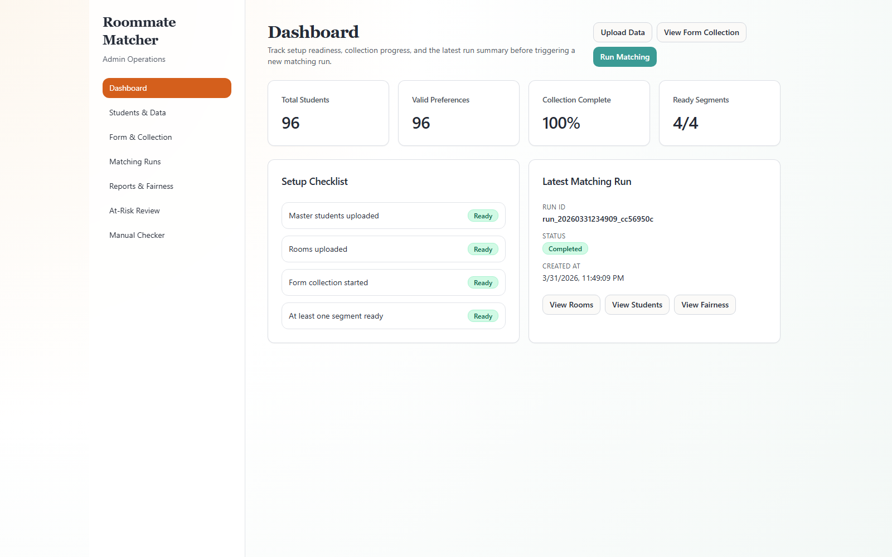
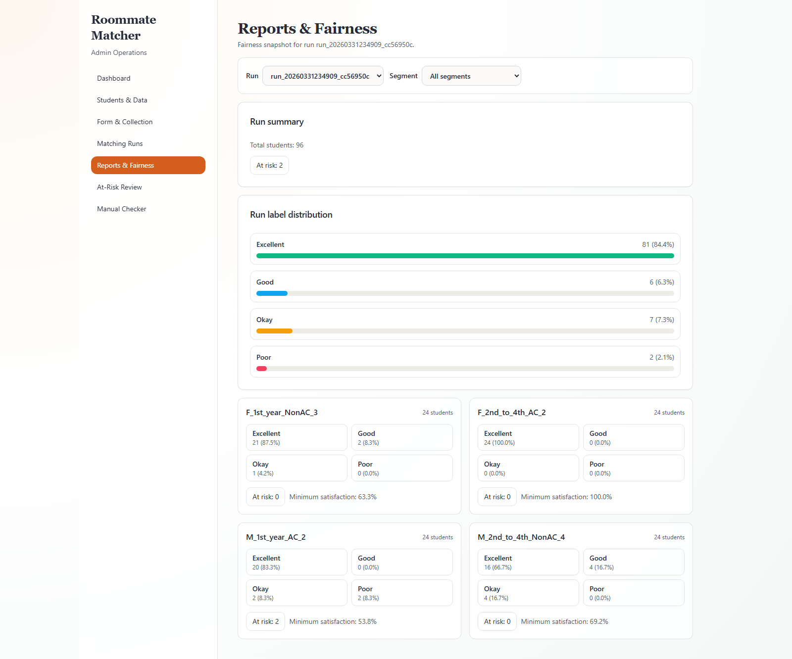

# Roommate Matcher

Roommate Matcher is a local-first decision-support system for hostel roommate allocation.
It ingests student and room data, computes compatibility scores, runs deterministic matching by segment, and exposes explainability + fairness outputs through an admin dashboard.

## What this project includes

- FastAPI backend with service-layer scoring, matching, explainability, fairness, and CSV ingestion.
- React + TypeScript admin and student UI.
- Deterministic demo-data seed flow and matching run generation.
- Local showcase mode (one server) and development mode (two servers).

## Prerequisites

- Python 3.11+
- Node.js 18+ and npm

## Quick Start (Showcase Mode, One Command)

From the repository root:

```powershell
start.bat
```

For POSIX shells:

```bash
sh ./start.sh
```

Then open:

- App: `http://127.0.0.1:8000`
- API docs: `http://127.0.0.1:8000/docs`

### Launcher bootstrap behavior (explicit)

The launcher is self-bootstrap by default, but optimized for repeat runs.

It performs these checks in order:

1. If `.venv` is missing, create it automatically with `python -m venv .venv`.
2. If backend runtime dependencies are missing in that interpreter, run `python -m pip install -e ./backend`; otherwise reuse installed backend packages.
3. If `frontend/node_modules` is missing, run `npm install`; otherwise reuse existing dependencies.
4. If `frontend/dist/index.html` is missing, run `npm run build`; otherwise reuse the existing frontend build.
5. If `data/app.db` is missing, run `python demo-data/seed.py --reset --run-matching`; otherwise reuse existing local data.

Force flags:

- Rebuild frontend even when `frontend/dist` exists:
	- `start.bat --rebuild-frontend`
	- `sh ./start.sh --rebuild-frontend`
- Reseed DB even when `data/app.db` exists:
	- `start.bat --reseed-data`
	- `sh ./start.sh --reseed-data`

Use both flags together for a full clean showcase refresh.

## Development Mode (Two Servers)

### Backend

```powershell
python -m venv .venv
.\.venv\Scripts\Activate.ps1
python -m pip install --upgrade pip
python -m pip install -e "./backend[dev]"
python demo-data/seed.py --reset --run-matching
Set-Location backend
python -m uvicorn app.main:app --reload --host 127.0.0.1 --port 8000
```

### Frontend

```powershell
Set-Location frontend
npm install
$env:VITE_API_BASE_URL="http://127.0.0.1:8000"
npm run dev
```

Frontend dev URL: `http://localhost:5173`

## Deterministic Seed Commands

```powershell
# Reset DB, rebuild schema, ingest demo CSVs, and run matching
python demo-data/seed.py --reset --run-matching

# Reset DB and rebuild schema only (no CSV ingestion)
python demo-data/seed.py --reset --schema-only
```

## Algorithm Notes

See [docs/algorithm.md](docs/algorithm.md) for the scoring weights, matching strategy, explainability flow, and fairness calculations used in this repository.

## Screenshots

### Dashboard



### Matching Results (Room View)


### Student Results


### Fairness Report



### Manual Checker


## Test and Validation Commands

### Backend

```powershell
Set-Location backend
python -m pytest
```

### Frontend unit tests

```powershell
Set-Location frontend
npm run test
```

### Frontend E2E

```powershell
Set-Location frontend
npm run e2e:install
npm run e2e
```

## Mandatory fresh-clone validation gate

Before calling the repo Phase 9 complete, run this exact check:

1. Clone the repository into a completely fresh directory.
2. Follow this README only, with no unstated manual setup.
3. Run one command (`start.bat` or `sh ./start.sh`).
4. Verify app load, matching artifacts, export flow, and direct route refresh behavior.

If any step requires hidden setup, Phase 9 is not complete.

## Known limitations (current scope)

- Local-only runtime (no cloud deployment target in v1).
- CSV export is supported; PDF reporting is out of scope for v1.
- Matching runs are synchronous in API flow.

## Roadmap (post-v1)

- PDF report export
- Run-to-run comparison views
- Advanced fairness metrics (for example envy-freeness and inequality measures)
- Optimization upgrades for larger cohorts
